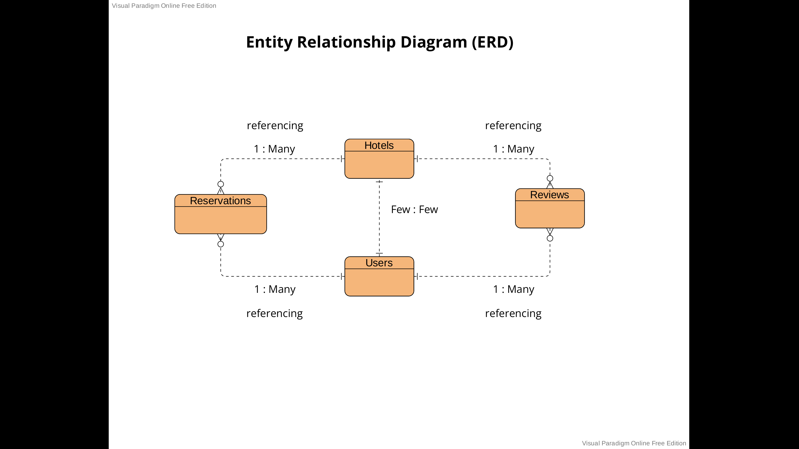

<h1> Marriott Select</h1>

 

<h2>Project Link</h2>
https://marriott-select.herokuapp.com/

<h2>Project Idea</h2>
Posting of hotels from the Marriott tier 3 collection. Two hotels from California. Eight hotels from Florida. View each hotel's detail page; pictures, info, reviews, possibly a map. Logged in user's can post their review and have it appear on the hotel's info page as a review card. User's can also update and delete only their posted reviews on the user account page.

 

<h2>Screenshots</h2>

<h2>Technologies Used</h2>

Node JS

Express

MongoDB

Mongoose

Heroku

Google OAuth 2.0

<h2>Trello</h2>

 

<h2>Wireframe</h2>
<a href="https://wireframe.cc/KDNCNq"> Link to wireframe</a>

 

<h2>Entity Relationship Diagram</h2>

 

<h2>Next Steps</h2>

login and signup with jwt

 book a reservation and make a payment with stripe 

 add hotel owner's to each hotel info page 

